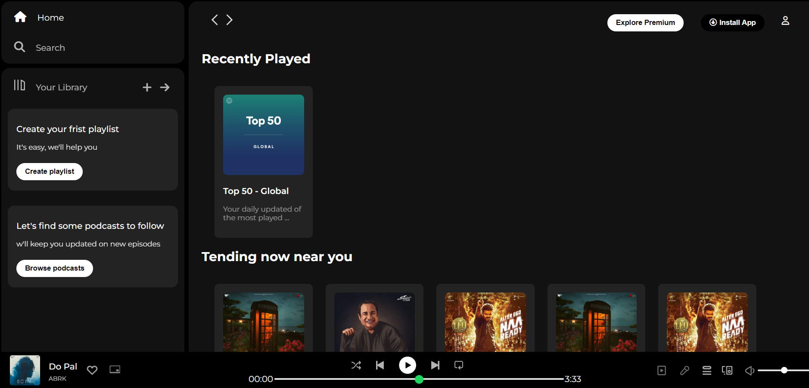

# Spotify Clone 🎵

This project is a frontend development implementation of a **Spotify Clone**. It aims to replicate the interface of the Spotify web application, focusing on responsive design and a clean user experience. This project demonstrates the use of **HTML** and **CSS** for creating a visually appealing and functional web page.

---

## 📁 Project Structure

The project structure is as follows:

```
SPOTIFY-CLONE/
│
├── assets/         # Contains images, icons, and other media assets
├── index.html      # Main HTML file
├── LICENSE         # License file
├── README.md       # Project documentation (this file)
└── style.css       # CSS file for styling the web page
```

---

## ✨ Features

- **Responsive Design**: Adaptable layout for different screen sizes.
- **Modern UI**: Clean and sleek design inspired by Spotify's interface.
- **Custom Styling**: Utilizes CSS for styling the components.
- **Interactive Elements**: Navigation bar, song list, and more.

---

## 🚀 How to Run the Project

1. Clone this repository:
   ```bash
   git clone https://github.com/your-username/spotify-clone.git
   ```
2. Navigate to the project directory:
   ```bash
   cd spotify-clone
   ```
3. Open `index.html` in your preferred browser:
   - Simply double-click on the file, or
   - Use the following command if you have Live Server installed:
     ```bash
     live-server
     ```

---

## 🛠️ Tools & Technologies Used

- **HTML**: Structuring the layout of the web page.
- **CSS**: Designing and styling the UI.
- **Visual Studio Code**: Code editor for development.

---

## 📄 License

This project is licensed under the terms of the [MIT License](./LICENSE). Feel free to use, modify, and distribute this project.

---

## 📷 Screenshots

Add relevant screenshots or GIFs here to showcase the project. Example:


---

## 💡 Future Enhancements

- Add **JavaScript functionality** for music playback.
- Create a **dark mode** toggle.
- Add **search functionality** for songs.
- Integrate with **Spotify API** to fetch real-time data.

---

## 📧 Contact

For any inquiries or feedback, feel free to contact me at:
- **Name**: Himanshu Jayswal
- **Email**: [your-himanshujayswal2006@gmail.com]
- **GitHub**: [github.com/your-username](https://github.com/himanshujays29)

---
